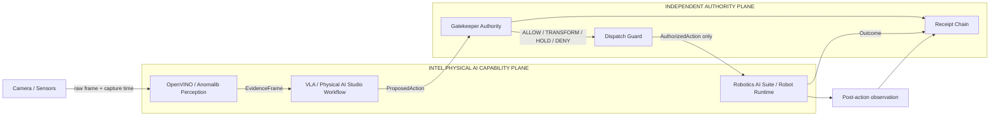
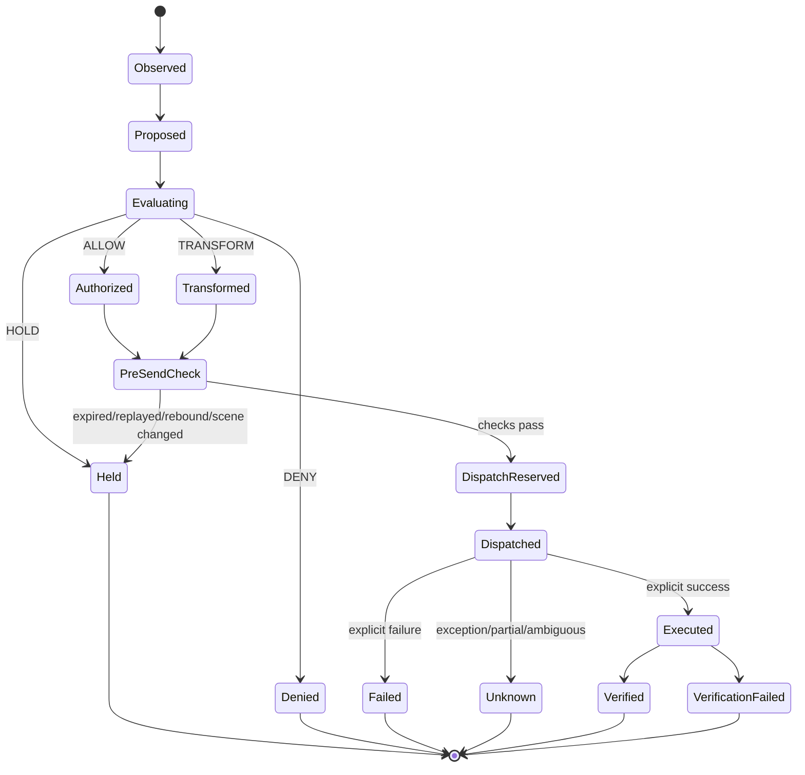

# Senior Engineer Architecture Review

## **INTEL® PHYSICAL AI CHALLENGE + GATEKEEPER PRE-EXECUTION AUTHORITY**

This document is the principal-engineer view of the system. It is intentionally more rigorous than the pitch. It exposes the state model, trust boundaries, contracts, temporal semantics, replay handling, failure modes, receipt integrity, residual risks and the exact role of the Intel stack.

The design goal is not to make the planner safer by persuasion. The design goal is to make unauthorized state transitions **structurally unreachable through the governed execution path**.

---

## 1. Architectural thesis

Physical AI compresses perception, inference, planning and actuation into one low-latency loop. The system therefore separates **capability** from **authority**.

A detector may perceive. A VLA may propose. A robot may be capable. None of those facts grant execution authority.

The governing invariant is

$$
I(x_{n+1})=I(x_n)=\iota,
$$

with admissible state space

$$
X_I=\{x\in X:I(x)=\iota\}.
$$

An executable transition must therefore satisfy

$$
C_I:X_I\rightarrow X_I.
$$

This is implemented operationally as:

```text
Observe -> Propose -> Authorize/Transform -> Dispatch -> Observe outcome -> Prove
```

The invariant constrains what may execute. It does **not** choose the uniquely optimal next action.

---

## 2. Sponsor technology is part of the architecture

The challenge architecture is intentionally complementary:

| Layer | Technology / responsibility | Claim state |
| --- | --- | --- |
| Edge execution host | **INTEL® CORE™ ULTRA** | onsite target until observed |
| Inference runtime | **OPENVINO™** | native software rehearsal verified |
| Defect/anomaly workflow | **ANOMALIB** | onsite trained-model target until recorded |
| Physical-AI integration surface | **PHYSICAL AI STUDIO** | onsite target until recorded |
| Robotics runtime/deployment | **ROBOTICS AI SUITE** | onsite target until recorded |
| Planner / VLA | event-selected / LeRobot-compatible provider | proposal only, never authority |
| Pre-execution authority | **GATEKEEPER** | independent deterministic authority boundary |
| Simulation | MuJoCo | development/rehearsal only, not sponsor attribution |

Intel's official challenge materials explicitly call for Intel Core Ultra, OpenVINO, Physical AI Studio and Robotics AI Suite in the Physical AI challenge. The demo therefore surfaces those components where they contribute, instead of reducing them to a stack slide.

---

## 3. System topology and trust boundaries



### Trust boundary T0: physical observation

The camera/sensor surface is outside the authority engine. A frame may be wrong, spoofed or stale. Therefore evidence identity and freshness are explicit inputs rather than implicit assumptions.

### Trust boundary T1: perception

Perception may be probabilistic. Its output is **evidence**, not permission. Model confidence, anomaly score and geometry are facts supplied to downstream logic.

### Trust boundary T2: planning

The VLA/planner is intentionally untrusted for authorization. It may propose a valid action, an overspeed action, an incomplete action or an action based on stale evidence.

### Trust boundary T3: authority

Gatekeeper evaluates the exact actor/evidence/action binding. This is the only component allowed to create an `AuthorizedAction` for the governed path.

### Trust boundary T4: dispatch

The dispatch guard can only **remove** permission. It rechecks binding, freshness, replay state, scene state and receipt integrity immediately before effect.

### Trust boundary T5: physical execution

Once a command is sent to a physical actuator, perfect transaction rollback is impossible. The architecture therefore distinguishes `dispatch_attempted`, `executed`, `FAILED` and `UNKNOWN`, and preserves partial-effect ambiguity instead of lying about atomicity.

---

## 4. Core data contracts

### EvidenceFrame

Represents the observation used to justify an action. Key properties include:

- unique evidence identity;
- capture timestamp;
- camera/source identity;
- sequence where available;
- SHA-256 binding to the exact captured bytes;
- confidence and anomaly observations;
- object/scene context;
- optional scene hash.

### ProposedAction

Represents capability, not authority. It includes:

- action identity;
- actor identity;
- exact `evidence_id` binding;
- action type;
- object identity;
- destination/target;
- speed;
- trajectory;
- request time.

### AuthorityDecision

Binds the original evidence and proposal to one of:

- **ALLOW**: original action may execute unchanged;
- **TRANSFORM**: only the explicitly returned replacement may execute;
- **HOLD**: no execution under current conditions;
- **DENY**: no execution because a policy/identity condition rejects the transition.

### DispatchResult

Separates:

- authority verdict;
- whether dispatch was attempted;
- whether execution was explicitly confirmed;
- actuator result;
- outcome receipt;
- end-to-end latency.

This separation matters because physical effect is not an ACID database transaction.

---

## 5. Authority state machine



Important property: there is no transition from `Proposed` directly to `Dispatched` in the governed path.

---

## 6. Safety and correctness properties

The implementation is organized around properties that can be falsified by tests.

### P1. No capability-to-actuator bypass

A proposal is never executable merely because the planner produced it.

### P2. Exact evidence/action binding

An authority response that changes actor identity, evidence identity or the original action binding cannot silently authorize a different command.

### P3. TRANSFORM is replacement authority

The original proposal does not remain executable after a TRANSFORM. Only the returned authorized physical replacement may enter dispatch.

### P4. HOLD and DENY are non-dispatching

Neither verdict invokes the actuator.

### P5. Temporal authority

Evidence must still be fresh when the action is about to dispatch, not merely when inference completed.

### P6. Replay resistance within the session

Consumed evidence/action identities and regressed frame sequences cannot be reused to produce another effect through the same orchestrator session.

### P7. Fail closed on authority uncertainty

Network failure, malformed authority output or contradictory decision structure cannot degrade into ALLOW.

### P8. Unknown physical outcomes remain unknown

An exception after dispatch is not rewritten as `NOT_EXECUTED`. If partial effect is possible, the record says so.

### P9. Receipt integrity precedes further effect

A corrupted receipt chain blocks new governed effects rather than allowing execution with an untrustworthy audit record.

### P10. Perception is not policy

An anomaly score is a fact. It becomes a denial condition only if declared authority policy says that the resulting transition is inadmissible.

---

## 7. Temporal model

Physical authority is time-sensitive.

Let

$$
T_{ttl}
$$

be the evidence lifetime and let

$$
T_{age}=t_{dispatch}-t_{capture}.
$$

Dispatch requires

$$
T_{age}<T_{ttl}.
$$

The end-to-end control-path budget is decomposed as

$$
T_{total}
=
T_{capture}
+T_{infer}
+T_{plan}
+T_{authority}
+T_{dispatch}
+T_{actuate}
+T_{verify}.
$$

The safety-relevant pre-effect portion is

$$
T_{pre}
=
T_{infer}+T_{plan}+T_{authority}+T_{dispatch}.
$$

The architecture reports these components separately. This matters because optimizing OpenVINO inference while hiding authority latency would be misleading, and reporting a fast authority hop while the whole path misses its freshness window would be equally misleading.

A monotonic execution lease is used so a stalled or adjusted wall clock cannot silently extend an already-issued permission window.

---

## 8. Replay and scene-change semantics

A frame hash proves byte identity. It does **not** prove freshness by itself.

The runtime therefore treats these as separate dimensions:

- content hash: what bytes were observed;
- evidence ID: which observation instance is being referenced;
- capture time: when it was observed;
- sequence: ordering within the source stream;
- optional scene hash: whether independently sampled scene state still matches.

A genuinely new capture of a static scene is not automatically a replay. Reusing the same consumed evidence identity or regressing the source sequence is.

Replay state is currently in-memory and session-scoped. Durable anti-replay across process restarts is a production requirement, not a hackathon claim.

---

## 9. Why the authority boundary is not just another guardrail

A model guardrail generally modifies or evaluates model output. This architecture instead controls **effect reachability**.

The planner may remain probabilistic. The detector may remain probabilistic. The actuator may remain highly capable. The governed path still requires a deterministic authority result bound to the exact transition.

That is the difference between:

```text
"The model should not do X"
```

and

```text
"No command producing state transition X is dispatchable through this authority boundary."
```

The latter is an infrastructure property rather than a behavioral aspiration.

---

## 10. Invariant-preserving interpretation

Let the planner propose `a_n` from evidence `e_n`. Authority computes

$$
\widehat a_n=\Pi_{I,e_n}(a_n).
$$

Operationally:

$$
\widehat a_n=
\begin{cases}
a_n, & \text{ALLOW},\\
a'_n, & \text{TRANSFORM},\\
\bot, & \text{HOLD or DENY}.
\end{cases}
$$

Execution is

$$
x_{n+1}=
\begin{cases}
E(\widehat a_n), & \widehat a_n\neq\bot,\\
x_n, & \widehat a_n=\bot.
\end{cases}
$$

This formulation is deliberately narrower than claiming the invariant selects the unique correct motion. It only defines admissibility.

---

## 11. Failure matrix

| Failure | Expected result | Physical effect |
| --- | --- | --- |
| stale evidence | HOLD | none |
| future-dated evidence | HOLD | none |
| actor not authorized | DENY | none |
| evidence binding mismatch | DENY/HOLD | none |
| overspeed proposal | TRANSFORM | only constrained replacement |
| malformed planner output | local HOLD/failure record | none |
| malformed authority response | fail-closed HOLD | none |
| authority transport outage | HOLD | none |
| replayed evidence/action | HOLD | none |
| scene changed before dispatch | HOLD | none |
| receipt chain invalid | block effect | none |
| actuator throws before confirmed result | UNKNOWN | partial effect possible |
| post-action verification fails | execution recorded, task not complete | effect may have occurred |

This table is intentionally asymmetric: uncertainty after dispatch cannot be converted into a false guarantee of non-execution.

---

## 12. Receipt model

The evidence plane records causality rather than just telemetry.

Conceptually:

```text
EvidenceFrame
    -> ProposedAction
    -> AuthorityDecision receipt
    -> Dispatch / physical outcome receipt
    -> Post-action verification receipt
```

Each receipt is chained to prior receipt state. The decision exists **before** physical effect; the outcome is appended **after** effect. The outcome never rewrites history to make the earlier authority decision appear different.

This provides a machine-readable answer to:

1. what was observed;
2. what was proposed;
3. what was authorized;
4. what was actually dispatched;
5. what the actuator reported;
6. what was observed afterward.

---

## 13. Residual risks and non-claims

Senior review should pay attention to what the architecture deliberately does **not** claim.

- A malicious process with direct actuator access can bypass an in-process authority boundary. Production requires OS/device-level mediation or a privileged execution broker.
- Camera/source authenticity is not cryptographically established by a SHA-256 frame hash alone.
- Replay state and receipts are currently in-memory rather than durable across restart.
- Physical braking, collision avoidance and emergency-stop guarantees belong to the robot/control layer.
- A HOLD during motion cannot reverse momentum already imparted to hardware.
- Production Gatekeeper service identity, availability and policy deployment require independent operational controls.
- The invariant does not solve ethics, motion planning or optimal control.
- The exploratory GOI/Asimov mathematics is explanatory research context, not a safety certification.

Explicit non-claims make the verified claims stronger.

---

## 14. Why this architecture fits Intel's Physical AI story

**INTEL** is demonstrating how AI moves from models into real-world machines. That is exactly where an authority boundary becomes valuable.

The system deliberately leaves Intel's stack doing what it is good at:

- **OPENVINO**: efficient inference;
- **ANOMALIB**: anomaly evidence when the trained workflow is live;
- **PHYSICAL AI STUDIO**: integration/workflow surface when bound onsite;
- **ROBOTICS AI SUITE**: robotics deployment/runtime when bound onsite;
- **INTEL CORE ULTRA**: edge execution target when observed onsite.

Gatekeeper does not replace those layers. It answers the separate question those layers should not answer for themselves:

> Is this exact proposed physical transition authorized, using this exact evidence, right now?

That separation allows Intel's capability stack to remain open and fast while the authority mechanism stays model-agnostic.

---

## 15. Senior-review checklist

A principal engineer reviewing this system should be able to verify the following without trusting the presentation narrative:

- the actuator is reachable only through the governed execution path used by the demo;
- the proposal is bound to an explicit evidence identity;
- authority is evaluated before dispatch;
- ALLOW cannot mutate the physical action;
- TRANSFORM cannot fall back to the original proposal;
- HOLD/DENY result in no actuator invocation;
- freshness is checked again near dispatch;
- replay and sequence regression are independently handled;
- receipt corruption stops subsequent governed execution;
- actuator exceptions preserve UNKNOWN/partial semantics;
- post-action verification is distinct from actuator acknowledgment;
- Intel runtime/device/model evidence is shown separately from authority evidence;
- simulation, onsite hardware and production-service claims remain separately labeled.

If those properties hold under adversarial tests, the architecture is doing more than integrating a model with a robot. It is defining and enforcing a machine-speed authority boundary around physical effect.

---

## 16. External attribution

The architecture uses sponsor names as text, not copied brand assets. Current public event materials identify **Intel** as the Physical AI hackathon host/challenge sponsor and call out Intel Core Ultra, OpenVINO, Physical AI Studio and Robotics AI Suite for the challenge.

AI Infra Summit's current Diamond Partners include **Ambarella**, **AMD**, **AWS**, **HCLTech**, **Intel**, **Oracle** and **Qualcomm**. Their event-level recognition does not imply that all of those companies' technologies are dependencies of this project.

Reference pages:

- Intel AI Infra Summit / Physical AI Challenge: https://www.intel.com/content/www/us/en/events/ai-infra-summit.html
- Intel Newsroom, AI Infra Summit 2026: https://newsroom.intel.com/artificial-intelligence/intel-at-ai-infra-summit-2026
- AI Infra Summit sponsors: https://www.ai-infra-summit.com/sponsors
